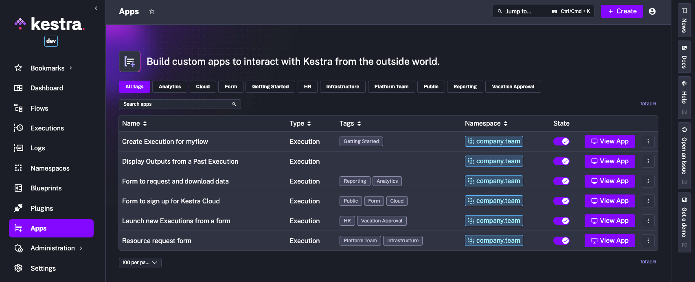

## Kestra Enterprise Edition Examples

This repository provides code needed to PoC Kestra Enterprise Edition, including apps, dashboards, and flows. Use this repository as a starting point.



## Repository Structure
- **`apps/`**: contains verified Apps configuration as code
- **`dashboards/`**: provides examples of custom dashboards as code which you can use to build custom charts querying your executions, metrics and logs
- **`flows/`**: flow definitions
- **`docker-compose-example.yml`**: basic Docker Compose configuration for setting up the environment with Postgres backend. Use this file as a reference for running services locally in a containerized setup.

## Prerequisites

- Docker and Docker Compose installed
- Basic knowledge of Kestra and YAML 
- Kestra Enterprise Edition license

## Usage

1. **Clone the Repository**:
   ```bash
   git clone https://github.com/kestra-io/enterprise-edition-examples.git
   cd enterprise-edition-examples
   ```

2. **Set Up Docker Compose**:
- Review and customize `docker-compose-example.yml` to match your environment.
- Rename the `docker-compose-example.yml` to `docker-compose.yml` and add your license key.
- Login to the Kestra registry using your license ID and fingerprint:
  ```bash
  docker login registry.kestra.io --username=licenseId --password=fingerprint
  ```
- Pull the latest Kestra Enterprise Edition image:
  ```bash
    docker pull registry.kestra.io/docker/kestra-ee:latest
    ```
- Start the services:
   ```bash
   docker compose up -d
   ```

3. **Configure Flows, Apps or Dashboards**:
- Add or modify flow definitions in the `flows/` directory.
- Add or modify Apps configuration in the `apps/` directory.
- Add or modify Dashboards configuration in the `dashboards/` directory.

4. **Access the Kestra UI**:
- Open your browser and navigate to `http://localhost:8080`.
- Add the flows, apps, and dashboards to your Kestra instance (or deploy via [CI/CD pipeline](https://kestra.io/docs/version-control-cicd/cicd)).

## Contributing

We welcome contributions to this repository. 

<details>
<summary>Expand for instructions on how to contribute to this repository.</summary>

1. Fork the repository.
2. Create a feature branch:
   ```bash
   git checkout -b feature/<feature-name>
   ```
3. Commit your changes:
   ```bash
   git commit -m "Add <feature-name>"
   ```
4. Push to the branch:
   ```bash
   git push origin feature/<feature-name>
   ```
5. Open a Pull Request.

</details>